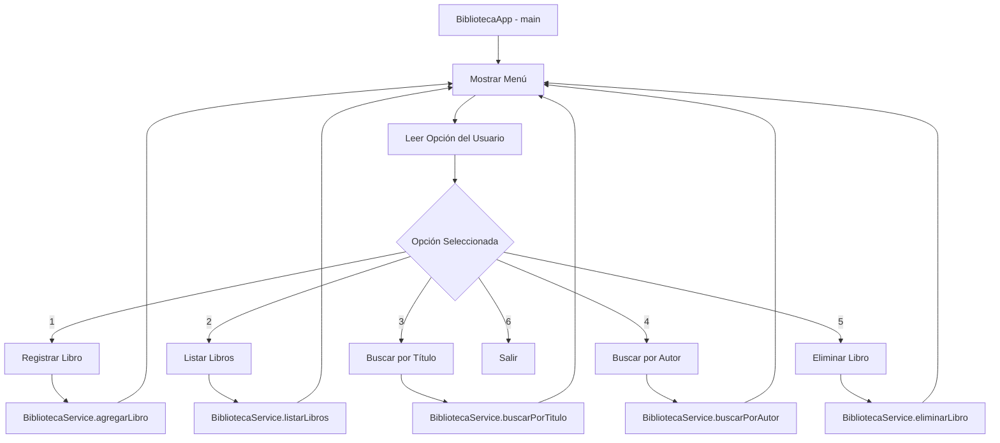

# INFORME TÉCNICO
## Sistema de Gestión de Biblioteca en Java

**Proyecto:** TF_GRUPO_U24269520  
**Autor:** GIANCARLOS ENRIQUE SANDOVAL TUME  
**Fecha:** Julio 2025  
**Lenguaje:** Java 8+  
**Herramientas:** Maven, IntelliJ IDEA/VS Code  

---

## 1. DESCRIPCIÓN DEL PROBLEMA Y OBJETIVO DE LA APLICACIÓN

### 1.1 Problemática Identificada
Las bibliotecas tradicionales enfrentan desafíos en la gestión manual de su inventario de libros, incluyendo:
- Dificultad para mantener un registro actualizado de los libros disponibles
- Pérdida de tiempo en la búsqueda manual de libros específicos
- Errores humanos en el registro y eliminación de libros
- Falta de un sistema centralizado para consultar información

### 1.2 Objetivo General
Desarrollar una aplicación de consola en Java que permita la gestión eficiente de una biblioteca, proporcionando funcionalidades básicas para el registro, búsqueda, listado y eliminación de libros.

### 1.3 Objetivos Específicos
- Implementar un sistema de registro de libros con información completa (título, autor, año, ISBN)
- Crear funcionalidades de búsqueda por título y autor
- Desarrollar un sistema de listado completo del inventario
- Implementar eliminación controlada de libros por ISBN
- Aplicar principios de programación orientada a objetos
- Utilizar manejo de excepciones para control de errores
- Organizar el código en una estructura modular y mantenible

---

## 2. DISEÑO Y ESTRUCTURA DEL PROYECTO

### 2.1 Arquitectura General
El proyecto sigue una arquitectura en capas que separa las responsabilidades:

```
biblioteca_java_maven/
├── src/main/java/
│   ├── model/          # Capa de datos
│   ├── service/        # Capa de lógica de negocio
│   ├── ui/             # Capa de presentación
│   └── exception/      # Manejo de excepciones
├── pom.xml            # Configuración Maven
└── README.md          # Documentación
```

### 2.2 Paquetes y Responsabilidades

#### 2.2.1 Paquete `model`
**Responsabilidad:** Definir las entidades del dominio del problema.

**Clase Principal:** `Libro.java`
- Representa la entidad libro con sus atributos básicos
- Implementa encapsulación mediante getters y setters
- Sobrescribe el método `toString()` para representación textual

```java
public class Libro {
    private String titulo;
    private String autor;
    private int anio;
    private String isbn;
    // Constructores, getters, setters y toString()
}
```

#### 2.2.2 Paquete `service`
**Responsabilidad:** Implementar la lógica de negocio y operaciones sobre los datos.

**Clase Principal:** `BibliotecaService.java`
- Gestiona la colección de libros en memoria
- Implementa operaciones CRUD (Create, Read, Update, Delete)
- Utiliza programación funcional con Streams para búsquedas

**Funcionalidades principales:**
- `agregarLibro(Libro libro)`: Registra un nuevo libro
- `listarLibros()`: Retorna todos los libros
- `buscarPorTitulo(String titulo)`: Búsqueda por título
- `buscarPorAutor(String autor)`: Búsqueda por autor
- `eliminarLibro(String isbn)`: Eliminación por ISBN

#### 2.2.3 Paquete `ui`
**Responsabilidad:** Manejar la interacción con el usuario a través de la consola.

**Clase Principal:** `BibliotecaApp.java`
- Punto de entrada de la aplicación (método `main`)
- Implementa un menú interactivo
- Maneja la entrada y salida de datos
- Coordina las llamadas al servicio de biblioteca

#### 2.2.4 Paquete `exception`
**Responsabilidad:** Definir excepciones personalizadas para el dominio.

**Clase Principal:** `LibroNoEncontradoException.java`
- Excepción checked para casos donde no se encuentra un libro
- Proporciona mensajes descriptivos de error

### 2.3 Patrones de Diseño Implementados

#### 2.3.1 Patrón de Capas (Layered Architecture)
- **Capa de Presentación (UI):** Maneja la interacción con el usuario
- **Capa de Lógica de Negocio (Service):** Procesa las operaciones de la biblioteca
- **Capa de Datos (Model):** Define las entidades del dominio

#### 2.3.2 Patrón Singleton (Implícito)
- El `BibliotecaService` se instancia una vez en la aplicación principal
- Garantiza un punto único de acceso a los datos

---

## 3. EXPLICACIÓN DE LA SOLUCIÓN Y COMPONENTES PRINCIPALES

### 3.1 Flujo de Funcionamiento



### 3.2 Componentes Principales

#### 3.2.1 Gestión de Datos en Memoria
La aplicación utiliza una `ArrayList<Libro>` para almacenar los libros en memoria durante la ejecución. Esta decisión se justifica por:
- Simplicidad de implementación
- No requiere base de datos externa
- Suficiente para el alcance del proyecto
- Permite operaciones dinámicas de redimensionamiento

#### 3.2.2 Búsquedas con Streams
Las funciones de búsqueda utilizan la API de Streams de Java 8:

```java
public List<Libro> buscarPorTitulo(String titulo) {
    return libros.stream()
            .filter(l -> l.getTitulo().equalsIgnoreCase(titulo))
            .collect(Collectors.toList());
}
```

**Ventajas:**
- Código más legible y funcional
- Operaciones no destructivas
- Facilita el mantenimiento
- Aprovecha las características modernas de Java

#### 3.2.3 Manejo de Excepciones
La aplicación implementa manejo de excepciones en múltiples niveles:

**Excepciones Checked:**
- `LibroNoEncontradoException`: Para casos de búsqueda sin resultados

**Excepciones Runtime:**
- `NumberFormatException`: Para validación de entrada numérica
- Validación de entrada en general

#### 3.2.4 Interfaz de Usuario
La interfaz de consola implementa:
- Menú cíclico hasta que el usuario elija salir
- Validación de entrada del usuario
- Mensajes informativos y de error claros
- Separación visual entre operaciones

---

## 4. EJEMPLOS DE USO Y RESULTADOS OBTENIDOS

### 4.1 Escenario 1: Registro de Libros

**Entrada del Usuario:**
```
Seleccione una opción: 1
Título: Cien años de soledad
Autor: Gabriel García Márquez
Año: 1967
ISBN: 978-84-376-0494-7
```

**Resultado:**
```
Libro registrado exitosamente.
```

### 4.2 Escenario 2: Listado de Libros

**Entrada del Usuario:**
```
Seleccione una opción: 2
```

**Resultado:**
```
Libros registrados:
Libro{titulo='Cien años de soledad', autor='Gabriel García Márquez', año=1967, isbn='978-84-376-0494-7'}
Libro{titulo='Don Quijote de la Mancha', autor='Miguel de Cervantes', año=1605, isbn='978-84-376-0495-4'}
```

### 4.3 Escenario 3: Búsqueda por Autor

**Entrada del Usuario:**
```
Seleccione una opción: 4
Ingrese el autor a buscar: Gabriel García Márquez
```

**Resultado:**
```
Libro{titulo='Cien años de soledad', autor='Gabriel García Márquez', año=1967, isbn='978-84-376-0494-7'}
```

### 4.4 Escenario 4: Eliminación de Libro

**Entrada del Usuario:**
```
Seleccione una opción: 5
Ingrese el ISBN del libro a eliminar: 978-84-376-0494-7
```

**Resultado:**
```
Libro eliminado exitosamente.
```

### 4.5 Escenario 5: Manejo de Errores

**Entrada del Usuario:**
```
Seleccione una opción: 5
Ingrese el ISBN del libro a eliminar: 123-456-789
```

**Resultado:**
```
No se encontró un libro con el ISBN proporcionado.
```

---

## 5. JUSTIFICACIÓN DE LA ORGANIZACIÓN Y DECISIONES TOMADAS

### 5.1 Arquitectura en Capas

**Decisión:** Separar el código en paquetes por responsabilidad.

**Justificación:**
- **Mantenibilidad:** Cada componente tiene una responsabilidad específica
- **Escalabilidad:** Fácil agregar nuevas funcionalidades sin afectar otros componentes
- **Testabilidad:** Cada capa puede probarse independientemente
- **Reutilización:** Los servicios pueden ser utilizados por diferentes interfaces

### 5.2 Uso de Collections Framework

**Decisión:** Utilizar `ArrayList<Libro>` para almacenamiento en memoria.

**Justificación:**
- **Simplicidad:** No requiere configuración de base de datos
- **Eficiencia:** Acceso directo en memoria con complejidad O(1) para acceso por índice
- **Flexibilidad:** Redimensionamiento dinámico
- **Adecuado para el alcance:** Suficiente para una aplicación de demostración

### 5.3 Programación Funcional con Streams

**Decisión:** Usar Streams para operaciones de búsqueda y filtrado.

**Justificación:**
- **Legibilidad:** Código más expresivo y fácil de entender
- **Inmutabilidad:** No modifica la colección original
- **Composabilidad:** Fácil combinar operaciones
- **Rendimiento:** Operaciones lazy y optimizadas internamente

### 5.4 Manejo de Excepciones Personalizadas

**Decisión:** Crear `LibroNoEncontradoException` como excepción checked.

**Justificación:**
- **Semántica clara:** El nombre indica exactamente qué problema ocurrió
- **Control explícito:** Obliga al código cliente a manejar el caso de error
- **Información contextual:** Permite proporcionar mensajes específicos
- **Diferenciación:** Distingue errores de negocio de errores técnicos

### 5.5 Encapsulación en el Modelo

**Decisión:** Usar getters y setters en lugar de campos públicos.

**Justificación:**
- **Encapsulación:** Protege el estado interno del objeto
- **Validación futura:** Permite agregar validaciones sin cambiar la interfaz
- **Mantenibilidad:** Facilita cambios internos sin afectar código cliente
- **Buenas prácticas:** Sigue convenciones estándar de JavaBeans

---

## 6. CÓDIGO FUENTE COMENTADO

### 6.1 Clase Libro (Model)

```java
package model;

/**
 * Clase que representa un libro en la biblioteca.
 * Implementa el patrón JavaBean con getters, setters y toString.
 */
public class Libro {
    // Atributos privados para mantener encapsulación
    private String titulo;
    private String autor;
    private int anio;
    private String isbn;

    /**
     * Constructor que inicializa todos los atributos del libro.
     * @param titulo Título del libro
     * @param autor Autor del libro
     * @param anio Año de publicación
     * @param isbn Código ISBN único del libro
     */
    public Libro(String titulo, String autor, int anio, String isbn) {
        this.titulo = titulo;
        this.autor = autor;
        this.anio = anio;
        this.isbn = isbn;
    }

    // Métodos getter y setter para cada atributo
    // Permiten acceso controlado al estado del objeto
    
    /**
     * Representación textual del libro para mostrar en consola.
     * Sobrescribe el método toString heredado de Object.
     * @return String formateado con información del libro
     */
    @Override
    public String toString() {
        return "Libro{" +
                "titulo='" + titulo + '\'' +
                ", autor='" + autor + '\'' +
                ", año=" + anio +
                ", isbn='" + isbn + '\'' +
                '}';
    }
}
```

### 6.2 Clase BibliotecaService (Service)

```java
package service;

import model.Libro;
import exception.LibroNoEncontradoException;
import java.util.ArrayList;
import java.util.List;
import java.util.stream.Collectors;

/**
 * Servicio que gestiona la lógica de negocio de la biblioteca.
 * Centraliza todas las operaciones sobre la colección de libros.
 */
public class BibliotecaService {
    // Lista que almacena todos los libros de la biblioteca
    private List<Libro> libros;

    /**
     * Constructor que inicializa la lista de libros vacía.
     */
    public BibliotecaService() {
        libros = new ArrayList<>();
    }

    /**
     * Agrega un libro a la biblioteca.
     * @param libro Objeto libro a agregar
     */
    public void agregarLibro(Libro libro) {
        libros.add(libro);
    }

    /**
     * Retorna una copia defensiva de todos los libros.
     * Evita modificaciones externas a la lista interna.
     * @return Lista de todos los libros registrados
     */
    public List<Libro> listarLibros() {
        return new ArrayList<>(libros);
    }

    /**
     * Busca libros por título utilizando comparación insensible a mayúsculas.
     * Utiliza programación funcional con Streams.
     * @param titulo Título a buscar
     * @return Lista de libros que coinciden con el título
     */
    public List<Libro> buscarPorTitulo(String titulo) {
        return libros.stream()
                .filter(l -> l.getTitulo().equalsIgnoreCase(titulo))
                .collect(Collectors.toList());
    }

    /**
     * Elimina un libro por ISBN.
     * Lanza excepción si no se encuentra el libro.
     * @param isbn ISBN del libro a eliminar
     * @throws LibroNoEncontradoException Si no existe libro con ese ISBN
     */
    public void eliminarLibro(String isbn) throws LibroNoEncontradoException {
        boolean eliminado = libros.removeIf(l -> l.getIsbn().equals(isbn));
        if (!eliminado) {
            throw new LibroNoEncontradoException(
                "No se encontró un libro con el ISBN proporcionado."
            );
        }
    }
}
```

### 6.3 Clase BibliotecaApp (UI)

```java
package ui;

import model.Libro;
import service.BibliotecaService;
import exception.LibroNoEncontradoException;
import java.util.List;
import java.util.Scanner;

/**
 * Clase principal que maneja la interfaz de usuario de consola.
 * Punto de entrada de la aplicación.
 */
public class BibliotecaApp {
    // Scanner estático para leer entrada del usuario
    private static final Scanner scanner = new Scanner(System.in);
    // Instancia del servicio de biblioteca
    private static final BibliotecaService biblioteca = new BibliotecaService();

    /**
     * Método principal que inicia la aplicación.
     * Implementa un bucle de menú hasta que el usuario decida salir.
     */
    public static void main(String[] args) {
        int opcion;
        do {
            mostrarMenu();
            opcion = leerOpcion();
            // Switch que maneja cada opción del menú
            switch (opcion) {
                case 1: registrarLibro(); break;
                case 2: listarLibros(); break;
                case 3: buscarLibroPorTitulo(); break;
                case 4: buscarLibroPorAutor(); break;
                case 5: eliminarLibro(); break;
                case 6: 
                    System.out.println("Saliendo del sistema. ¡Hasta luego!");
                    break;
                default:
                    System.out.println("Opción inválida. Intente nuevamente.");
            }
        } while (opcion != 6);
    }

    /**
     * Muestra el menú principal de opciones.
     */
    private static void mostrarMenu() {
        System.out.println("\n--- Menu Biblioteca ---");
        System.out.println("1. Registrar libro");
        System.out.println("2. Listar libros");
        System.out.println("3. Buscar libro por titulo");
        System.out.println("4. Buscar libro por autor");
        System.out.println("5. Eliminar libro");
        System.out.println("6. Salir");
        System.out.print("Seleccione una opcion: ");
    }

    /**
     * Lee y valida la opción seleccionada por el usuario.
     * Maneja NumberFormatException para entradas inválidas.
     * @return Número de opción seleccionada, -1 si es inválida
     */
    private static int leerOpcion() {
        String input = scanner.nextLine();
        try {
            return Integer.parseInt(input.trim());
        } catch (NumberFormatException e) {
            return -1; // Opción inválida
        }
    }

    /**
     * Maneja el registro de un nuevo libro.
     * Incluye validación de entrada y manejo de errores.
     */
    private static void registrarLibro() {
        try {
            System.out.print("Título: ");
            String titulo = scanner.nextLine();
            System.out.print("Autor: ");
            String autor = scanner.nextLine();
            System.out.print("Año: ");
            int anio = Integer.parseInt(scanner.nextLine());
            System.out.print("ISBN: ");
            String isbn = scanner.nextLine();
            
            // Crea el objeto libro y lo registra
            Libro libro = new Libro(titulo, autor, anio, isbn);
            biblioteca.agregarLibro(libro);
            System.out.println("Libro registrado exitosamente.");
        } catch (NumberFormatException e) {
            System.out.println("Error: El año debe ser un número entero.");
        }
    }
}
```

---

## 7. TECNOLOGÍAS Y HERRAMIENTAS UTILIZADAS

### 7.1 Lenguaje de Programación
- **Java 8+**: Utiliza características modernas como Streams API, expresiones lambda
- **Ventajas**: Multiplataforma, robusto, amplio ecosistema

### 7.2 Herramientas de Construcción
- **Maven**: Gestión de dependencias y automatización de construcción
- **Configuración**: Definida en `pom.xml` con plugins necesarios

### 7.3 Entorno de Desarrollo
- **VS Code** con extensiones de Java
- **Git** para control de versiones
- **Windows PowerShell** para ejecución de comandos

### 7.4 Estructura Maven Estándar
```
src/
  main/
    java/          # Código fuente principal
  test/
    java/          # Tests unitarios (no implementados en esta versión)
target/            # Archivos compilados
pom.xml           # Configuración del proyecto
```

---

## 8. PRINCIPIOS DE PROGRAMACIÓN APLICADOS

### 8.1 Programación Orientada a Objetos

#### Encapsulación
- Atributos privados en la clase `Libro`
- Acceso controlado mediante getters y setters
- Ocultación de implementación interna

#### Abstracción
- Separación clara entre interfaz y implementación
- El usuario no necesita conocer cómo se almacenan los datos

#### Modularidad
- Separación de responsabilidades en diferentes paquetes
- Cada clase tiene una responsabilidad específica

### 8.2 Principios SOLID

#### Single Responsibility Principle (SRP)
- `Libro`: Solo representa un libro
- `BibliotecaService`: Solo maneja lógica de biblioteca
- `BibliotecaApp`: Solo maneja interfaz de usuario

#### Open/Closed Principle (OCP)
- El sistema está abierto para extensión (nuevas funcionalidades)
- Cerrado para modificación (código existente estable)

### 8.3 Programación Funcional
- Uso de Streams para operaciones de colección
- Funciones puras sin efectos secundarios en búsquedas
- Expresiones lambda para filtrado

---

## 9. CONCLUSIONES Y POSIBLES MEJORAS

### 9.1 Conclusiones

#### Objetivos Alcanzados
✅ **Sistema funcional completo**: Todas las funcionalidades requeridas implementadas  
✅ **Arquitectura modular**: Código organizado y mantenible  
✅ **Principios POO**: Aplicación correcta de encapsulación y abstracción  
✅ **Manejo de errores**: Excepciones personalizadas y validación de entrada  
✅ **Documentación completa**: Código comentado y documentación técnica  

#### Aprendizajes Obtenidos
- **Importancia de la arquitectura**: La separación en capas facilita el mantenimiento
- **Valor de las pruebas**: Aunque no implementadas, son cruciales para calidad
- **Programación funcional**: Los Streams mejoran la legibilidad del código
- **Manejo de excepciones**: Control de errores mejora la experiencia del usuario

### 9.2 Posibles Mejoras

#### 9.2.1 Mejoras Inmediatas

**Persistencia de Datos**
```java
// Implementar guardado en archivo
public void guardarEnArchivo(String nombreArchivo) {
    // Serialización JSON o texto plano
}

public void cargarDesdeArchivo(String nombreArchivo) {
    // Deserialización al iniciar la aplicación
}
```

**Validaciones Mejoradas**
```java
public class Libro {
    public void setAnio(int anio) {
        if (anio < 0 || anio > LocalDate.now().getYear()) {
            throw new IllegalArgumentException("Año inválido");
        }
        this.anio = anio;
    }
}
```

**Búsqueda Parcial**
```java
public List<Libro> buscarPorTituloContiene(String termino) {
    return libros.stream()
        .filter(l -> l.getTitulo().toLowerCase()
                     .contains(termino.toLowerCase()))
        .collect(Collectors.toList());
}
```

#### 9.2.2 Mejoras a Mediano Plazo

**Tests Unitarios**
```java
@Test
public void testAgregarLibro() {
    BibliotecaService service = new BibliotecaService();
    Libro libro = new Libro("Test", "Autor", 2023, "123");
    service.agregarLibro(libro);
    assertEquals(1, service.listarLibros().size());
}
```

**Interfaz Gráfica**
- Migración a JavaFX o Swing
- Interfaz web con Spring Boot
- API REST para integración con otros sistemas

**Base de Datos**
- Integración con MySQL o PostgreSQL
- ORM con Hibernate
- Pool de conexiones

#### 9.2.3 Mejoras a Largo Plazo

**Arquitectura Microservicios**
- Separar en servicios independientes
- API Gateway para coordinación
- Containerización con Docker

**Características Avanzadas**
- Sistema de préstamos y devoluciones
- Gestión de usuarios y permisos
- Reportes y estadísticas
- Búsqueda avanzada con filtros múltiples
- Sistema de notificaciones

**Escalabilidad**
- Cache distribuido (Redis)
- Búsqueda con Elasticsearch
- Balanceador de carga
- Métricas y monitoreo

### 9.3 Valor Educativo del Proyecto

Este proyecto demuestra efectivamente:
- **Aplicación práctica de POO**: Conceptos teóricos llevados a la práctica
- **Arquitectura de software**: Importancia de la organización del código
- **Buenas prácticas**: Comentarios, nomenclatura, manejo de excepciones
- **Herramientas profesionales**: Maven, Git, IDEs modernos

---

## 10. REFERENCIAS Y RECURSOS

### 10.1 Documentación Técnica
- [Oracle Java Documentation](https://docs.oracle.com/javase/8/docs/)
- [Apache Maven Guide](https://maven.apache.org/guides/)
- [Java Streams API](https://docs.oracle.com/javase/8/docs/api/java/util/stream/package-summary.html)

### 10.2 Buenas Prácticas
- Clean Code: A Handbook of Agile Software Craftsmanship - Robert C. Martin
- Effective Java - Joshua Bloch
- Java: The Complete Reference - Herbert Schildt

### 10.3 Herramientas de Desarrollo
- [Visual Studio Code](https://code.visualstudio.com/)
- [Extension Pack for Java](https://marketplace.visualstudio.com/items?itemName=vscjava.vscode-java-pack)
- [Git](https://git-scm.com/)

---

**Fin del Informe Técnico**

*Este documento describe completamente la implementación, diseño y justificación del Sistema de Gestión de Biblioteca desarrollado como parte del proyecto académico TF_GRUPO_U24269520.*
